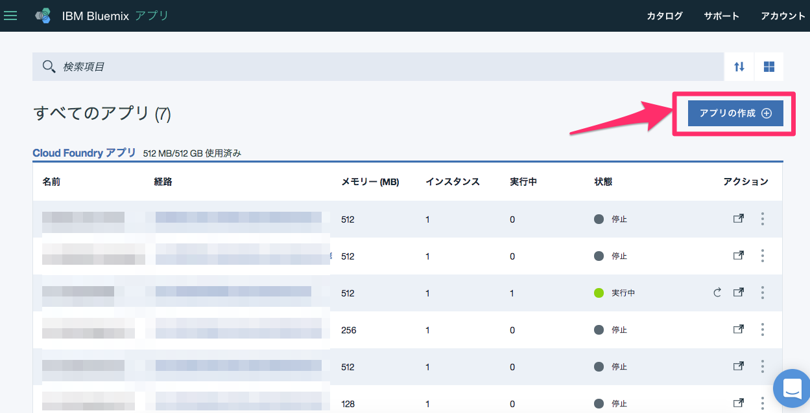
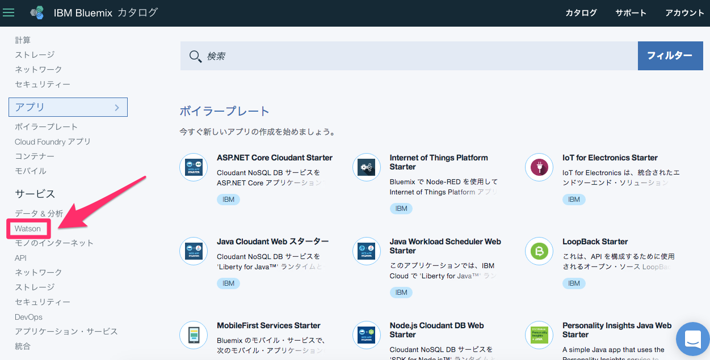
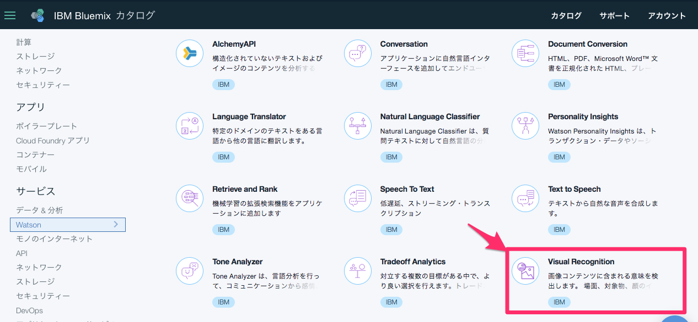
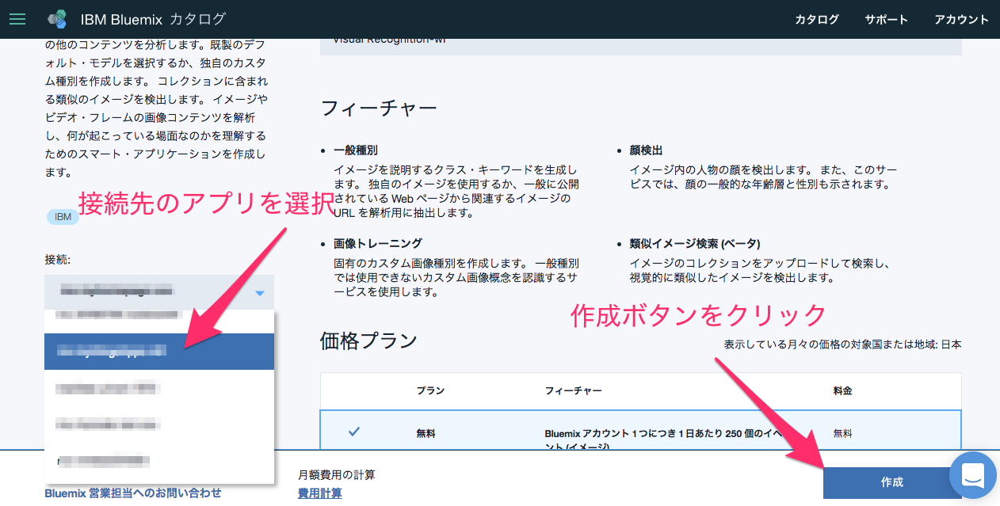
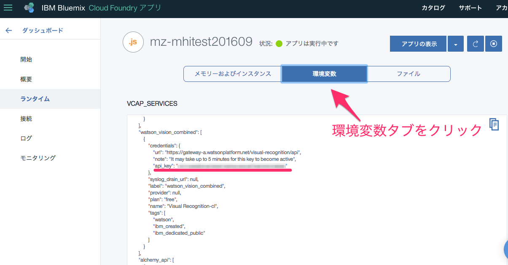
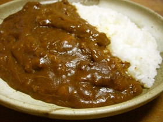
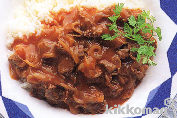
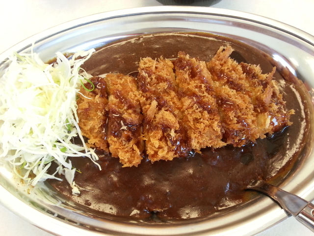

## IBM Watsonで画像を学習させてみよう
はじめに
1. IBM Bluemixのアカウントを作成してください。[アカウントの作成方法はこちら。](https://youtu.be/rdudF22X68Q?list=PLSWt5tGb2SKzefQ3xnDULIrvTy2wVj0h1)

2. curlをインストールしてください。

3. 学習用画像ファイル（zipファイル）をダウンロードしてください。
 * Curry.zip
 * Hayashi.zip
 * KatsuC.zip
 * Others.zip
 * test_curry.jpg
 * test_katsuc.jpg
 * test_hayashi.jpg


***
### 概要
IBM Watsonのサービスの一つであるVisual Recognition APIを使って画像を学習させるチュートリアルです。
IBM Watsonにカレーやハヤシライスやカツカレーが学習できるか挑戦してみるチュートリアルです。
***
## 1.BluemixでNode.jsサーバーを立てる
[サーバーの立て方はこちらをご参考。](https://youtu.be/n3muCRup9MI?list=PLSWt5tGb2SKzefQ3xnDULIrvTy2wVj0h1)

## 2.WatsonのAPIをバインドする
アプリ一覧の右上のアプリ作成をクリック。


カタログメニューの左側からWatsonを選択。


メニューからVisual Recognitionを選択。


接続するアプリケーションを選択。その後、右下の作成ボタンをクリック。


アプリを最ステージ後、アプリケーションのランタイムメニューから環境変数を選択。
WatsonのAPIを呼び出す際にapi_keyを使うのでメモっておく。

M

## 3.画像を学習する
ひとまずサンプルのカレー画像が認識されるかWatsonくんに聞いてみます。



Terminalを立ち上げ、画像のあるフォルダから以下のコマンドでカレーの画像を読み込ませてテストしてみます。

```
curl -X POST -F "images_file=@test_curry.jpg" "https://gateway-a.watsonplatform.net/visual-recognition/api/v3/classify?api_key={api_key}&version=2016-05-20"
```

結果のほどは・・・。

```
{
    "custom_classes": 0,
    "images": [
        {
            "classifiers": [
                {
                    "classes": [
                        {
                            "class": "food",
                            "score": 0.973403
                        }
                    ],
                    "classifier_id": "default",
                    "name": "default"
                }
            ],
            "image": "images8.jpg"
        }
    ],
    "images_processed": 1
}
```

ほー・・・。foodとな。そう来るか・・・Watsonくん。ということで、Watsonにカレー大食い選手権に出てもらいましょう。
カレーを30杯食べさせてみます。さらにカレーではないものも（丼ものなど）食べさせてカレーを学習させます。
（人間だったら辛い作業ですね。）

* xxxx_positive_examples=@xxx.zip ・・・学習させたい画像
* xxxx_negative_examples=@xxx.zip ・・・ネガティブ評価として使う画像
* name=food でfoodという分類の中でさらに識別クラスを学習させる
[参考にしたサイトはこちら。](http://qiita.com/mfujita/items/a6bfcffae8097807f6a0)

```
curl -X POST -F "curry_positive_examples=@Curry.zip" -F "negative_examples=@Others.zip" -F "name=food" "https://gateway-a.watsonplatform.net/visual-recognition/api/v3/classifiers?api_key={api_key}&version=2016-05-20"
```

結果、吐き出されたWatsonのレスポンスは以下の通り。statusがtrainingになっています。

```
{
    "classifier_id": "food_aaaaaaaaa",
    "name": "food",
    "owner": "4febae1a-a8e1-43d4-9597-2ae7a48734d9",
    "status": "training",
    "created": "2016-12-05T17:43:13.433Z",
    "classes": [{"class": "curry"}]
}
```

少し経ってから、以下のコマンドで進行状況をチェックしてみます。（classifier_idおよび、api_keyは各自のものをご利用ください。）

```
curl -X GET "https://gateway-a.watsonplatform.net/visual-recognition/api/v3/classifiers/{classifier_id}?api_key={api_key}&version=2016-05-20"
```
結果は、以下の通り。
```
{
    "classifier_id": "food_aaaaaaaaa",
    "name": "food",
    "owner": "4febae1a-a8e1-43d4-9597-2ae7a48734d9",
    "status": "ready",
    "created": "2016-12-05T17:43:13.433Z",
    "classes": [{"class": "curry"}]
}
```

statusがreadyになっているのでこれで行けそうです。カレーを認識したようです。

では、さっそく試してみましょう。カスタマイズした識別クラスを使うため、以下のようなparams-curry.jsonファイルをつくります。
（classifier_idsも各自のものをご利用ください。）

```
{"classifier_ids": ["food_aaaaaaaaa","default"], "threshold":0.2 }
```

それでは、この識別クラスを使ってさっそく認識できるかテストしてみます。Curryというクラスが高得点で出力されれば成功です！

先程のカレーを認識できるかテストしてみましょう！

```
curl -X POST -F "images_file=@test_curry.jpg" -F "parameters=@params-curry.json" "https://gateway-a.watsonplatform.net/visual-recognition/api/v3/classify?api_key={api_key}&version=2016-05-20"
```

果たして結果は・・。

```
{
    "custom_classes": 1,
    "images": [
        {
            "classifiers": [
                {
                    "classes": [
                        {
                            "class": "food",
                            "score": 0.992608
                        },
                        {
                            "class": "gravy",
                            "score": 0.268941,
                            "type_hierarchy": "/foods/sauces/gravy"
                        }
                    ],
                    "classifier_id": "default",
                    "name": "default"
                },
                {
                    "classes": [
                        {
                            "class": "curry",
                            "score": 0.64824
                        }
                    ],
                    "classifier_id": "food_aaaaaaaaa",
                    "name": "food"
                }
            ],
            "image": "test_curry.jpg"
        }
    ],
    "images_processed": 1
}
```

おぉ！Curryのスコアが0.648という高得点を叩き出しました！


## 3.ハヤシライス、カツカレーとの区別はできるかWatsonくん

ハヤシライスもカツカレーもWatsonは知らないようなので、さっそくまた大食い選手権に出て頂きましょう！Food in!!

無料プランでは識別クラスは1つしか作れないので、さきほど作成したクラスを一旦削除します。
（classifier_idsとapi_keyは各自のものをご利用ください。）

```
curl -X DELETE "https://gateway-a.watsonplatform.net/visual-recognition/api/v3/classifiers/food_aaaaaaaaa?api_key={api_key}&version=2016-05-20"
```

このあとカレーの識別クラスとハヤシライスの識別クラス、カツカレーの識別クラスを学習させます。

```
curl -X POST -F "curry_positive_examples=@Curry.zip" -F "hayashi_positive_examples=@Hayashi.zip" -F "katsu_curry_positive_examples=@KatsuC.zip" -F "negative_examples=@Others.zip" -F "name=food" "https://gateway-a.watsonplatform.net/visual-recognition/api/v3/classifiers?api_key={api_key}&version=2016-05-20"
```

・・・どうだ。Watsonから学習しているとの応答あり。

```
{
    "classifier_id": "food_bbbbbbbbb",
    "name": "food",
    "owner": "4febae1a-a8e1-43d4-9597-2ae7a48734d9",
    "status": "training",
    "created": "2016-12-05T18:26:00.192Z",
    "classes": [
        {"class": "katsu_curry"},
        {"class": "hayashi"},
        {"class": "curry"}
    ]
}
```

さきほど同様にステータスチェック。（classifier_idは各自のものをご利用ください。）

```
curl -X GET "https://gateway-a.watsonplatform.net/visual-recognition/api/v3/classifiers/{classifier_id}?api_key={api_key}&version=2016-05-20"
```

```
{
    "classifier_id": "food_bbbbbbbbb",
    "name": "food",
    "owner": "4febae1a-a8e1-43d4-9597-2ae7a48734d9",
    "status": "ready",
    "created": "2016-12-05T18:26:00.192Z",
    "classes": [
        {"class": "katsu_curry"},
        {"class": "hayashi"},
        {"class": "curry"}
    ]
}
```


クラスもready状態なのでさっそく試してみましょう。この識別クラスを使うための設定ファイルを使用するために以下のようなparams-new.jsonファイルを編集します。（classifier_idsは各自のものをご利用ください。）

```
{"classifier_ids": ["food_bbbbbbbbb","default"], "threshold":0.2 }
```

それでは、さっそく先程のカレーを投入!!


```
curl -X POST -F "images_file=@test_curry.jpg" -F "parameters=@params-new.json" "https://gateway-a.watsonplatform.net/visual-recognition/api/v3/classify?api_key={api_key}&version=2016-05-20"
```

実行結果は・・・。

```
{
    "custom_classes": 3,
    "images": [
        {
            "classifiers": [
                {
                    "classes": [
                        {
                            "class": "food",
                            "score": 0.992608
                        },
                        {
                            "class": "gravy",
                            "score": 0.268941,
                            "type_hierarchy": "/foods/sauces/gravy"
                        }
                    ],
                    "classifier_id": "default",
                    "name": "default"
                },
                {
                    "classes": [
                        {
                            "class": "curry",
                            "score": 0.858555
                        },
                        {
                            "class": "katsu_curry",
                            "score": 0.293688
                        }
                    ],
                    "classifier_id": "food_341155540",
                    "name": "food"
                }
            ],
            "image": "test_curry.jpg"
        }
    ],
    "images_processed": 1
}
```

カレー、というスコアが0.858555という高得点で他の追随を許しませんでした！成功です！

それでは次にハヤシライス。これは難しそうだ・・・。




```
curl -X POST -F "images_file=@test_hayashi.jpg" -F "parameters=@params-new.json" "https://gateway-a.watsonplatform.net/visual-recognition/api/v3/classify?api_key{api_key}&version=2016-05-20"
```

人間でも見分けるのが一瞬迷うが果たして結果は・・。

```
{
    "custom_classes": 3,
    "images": [
        {
            "classifiers": [
                {
                    "classes": [
                        {
                            "class": "food",
                            "score": 0.973403
                        },
                        {
                            "class": "dinner",
                            "score": 0.28905,
                            "type_hierarchy": "/activities/events/dinner"
                        },
                        {
                            "class": "restaurant",
                            "score": 0.268941,
                            "type_hierarchy": "/organizations/businesses/restaurant"
                        }
                    ],
                    "classifier_id": "default",
                    "name": "default"
                },
                {
                    "classes": [
                        {
                            "class": "hayashi",
                            "score": 0.95124
                        }
                    ],
                    "classifier_id": "food_341155540",
                    "name": "food"
                }
            ],
            "image": "test_hayashi.jpg"
        }
    ],
    "images_processed": 1
}
```
おぉ！ハヤシライスが0.95124という高得点がでました！
最後はカツカレー！



```
curl -X POST -F "images_file=@test_katsuc.jpg" -F "parameters=@params-new.json" "https://gateway-a.watsonplatform.net/visual-recognition/api/v3/classify?api_key={api_key}&version=2016-05-20"
```

この結果も・・・。

```
{
    "custom_classes": 3,
    "images": [
        {
            "classifiers": [
                {
                    "classes": [
                        {
                            "class": "food",
                            "score": 0.973403
                        }
                    ],
                    "classifier_id": "default",
                    "name": "default"
                },
                {
                    "classes": [
                        {
                            "class": "katsu_curry",
                            "score": 0.908661
                        }
                    ],
                    "classifier_id": "food_341155540",
                    "name": "food"
                }
            ],
            "image": "test_katsuc.jpg"
        }
    ],
    "images_processed": 1
}
```
カツカレーも0.908661という高得点！文句なしですね！

## 効率的な学習方法について
[Watson Developer Cloudを参照してください。](https://www.ibm.com/watson/developercloud/doc/visual-recognition/customizing.shtml#goodtraining)
